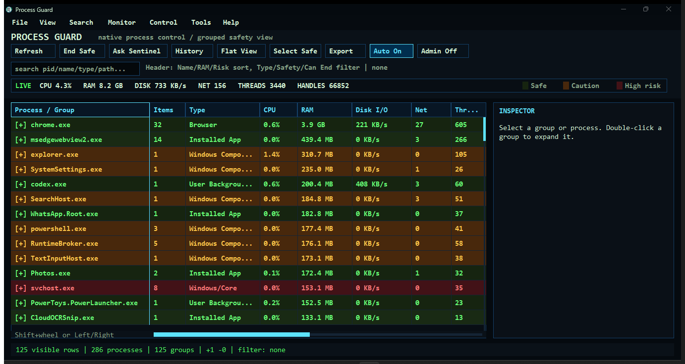
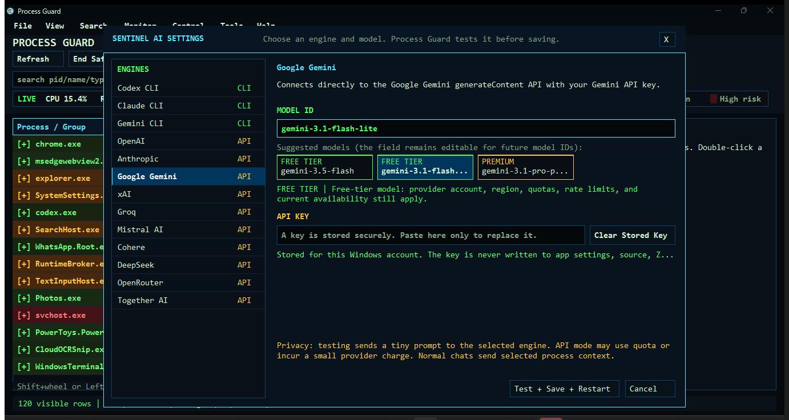

# Process Guard

Process Guard is a lightweight, open-source Windows process manager written in native Rust. It groups related processes, displays live resource activity, provides conservative safety guidance, and lets users end only selected processes classified as safe. Sentinel adds optional process explanations through a local AI CLI or a user-supplied API key.

Version: **1.0.2**  
Platform: **Windows 10/11 x64**  
License: **MIT**

## Highlights

- Native Win32/GDI interface with no browser runtime, Electron, or Tauri dependency
- Grouped and flat process views with expandable child PIDs
- Live CPU, RAM, disk I/O, network, thread, and handle metrics
- Green, orange, and red process safety guidance with reasons
- Multi-select, Select Safe, grouped safe actions, and confirmation before termination
- Search, column filtering, horizontal scrolling, and a frozen Process/Group column
- Process tree, network connection, signature, executable detail, and snapshot reports
- Watchlists, resource alerts, automatic efficiency rules, suspend/resume, priority, and affinity tools
- System tray support, normal/admin relaunch, process launcher, and contextual right-click commands
- Movable and resizable Sentinel chat with saved, pinned, regeneratable conversation history
- Configurable Sentinel engine and model under **Help > Sentinel AI Settings**
- Included, Free Tier, Standard, and Premium model guidance
- Automatic engine/model validation before settings or new API keys are saved

Safety labels are guidance, not a guarantee. Ending a process can close an app, interrupt work, or lose unsaved data. Process Guard blocks or treats Windows core, security, service, and uncertain processes cautiously.

## Screenshots





See the illustrated [usage guide](docs/USAGE.md) for the main process workflow and Sentinel setup.

## Sentinel Engines

Sentinel supports three local CLI engines and ten API providers. The model field is editable because provider catalogs and account access change over time.

| Engine | Mode | Suggested model IDs |
| --- | --- | --- |
| Codex CLI | CLI | `default`, `gpt-5.3-codex`, `gpt-5.6` |
| Claude CLI | CLI | `default`, `sonnet`, `opus`, `haiku` |
| Gemini CLI | CLI | `auto`, `gemini-3.5-flash`, `gemini-3.1-pro-preview` |
| OpenAI | API | `gpt-5.4-mini`, `gpt-5.6-terra`, `gpt-5.6-luna`, `gpt-5.6-sol` |
| Anthropic | API | `claude-haiku-4-5`, `claude-sonnet-4-6`, `claude-opus-4-6` |
| Google Gemini | API | `gemini-3.5-flash`, `gemini-3.1-flash-lite`, `gemini-3.1-pro-preview` |
| xAI | API | `grok-4.3`, `grok-latest`, `grok-4.5` |
| Groq | API | `openai/gpt-oss-20b`, `openai/gpt-oss-120b`, `qwen/qwen3.6-27b` |
| Mistral AI | API | `mistral-small-latest`, `codestral-latest`, `mistral-large-latest` |
| Cohere | API | `command-a-03-2025`, `command-a-plus-05-2026` |
| DeepSeek | API | `deepseek-v4-flash`, `deepseek-v4-pro` |
| OpenRouter | API | `openrouter/free`, `openrouter/auto`, or another enabled model ID |
| Together AI | API | `openai/gpt-oss-120b`, `Qwen/Qwen3.6-Plus`, `moonshotai/Kimi-K2.6` |

CLI mode requires the selected CLI to be installed and signed in separately. Process Guard launches it without a visible terminal window. API mode is intentionally available only in the Setup-installed copy, not the portable EXE.

Models are labeled **Included**, **Free Tier**, **Standard**, or **Premium**. Free or CLI-included choices appear first when the provider offers them. Providers without a guaranteed free API model show a lower-cost/default model first and explicitly warn that billing may apply. **Test + Save + Restart** sends a tiny prompt to the selected engine and model; no setting or staged API key is committed unless the test succeeds. The test may consume quota or incur a small provider charge.

## API Key Security

- API keys are stored as generic credentials in Windows Credential Manager for the current Windows account.
- Keys are masked in the UI and never written to `ProcessGuard_Settings.txt`.
- Keys are never embedded in `ProcessGuard.exe`, source archives, release ZIPs, or repository files.
- Process Guard passes the key to a hidden API worker through its process environment, not command-line arguments.
- Provider errors are reduced to a generic message so a secret cannot be copied into Sentinel history.
- Full-data uninstall removes all ten stored Sentinel API credentials; preserving user data keeps them for reinstall.

An API request necessarily sends the selected process context, conversation prompt, and key to the chosen provider. The provider's billing, retention, account, model-access, and usage policies apply.

## Downloads

GitHub Releases should contain:

- `ProcessGuard-Setup-1.0.2.exe`: recommended installer with setup and uninstall wizards
- `ProcessGuard.exe`: portable build; CLI Sentinel engines only
- `ProcessGuard-Source-1.0.2.zip`: clean source archive
- `SHA256SUMS.txt`: release file checksums

The executables are not code-signed in this personal open-source release. Windows SmartScreen may show an unknown publisher warning.

## Build From Source

Requirements:

- Windows 10 or 11 x64
- Rust stable with the MSVC toolchain
- Visual Studio Build Tools or Windows SDK tools
- Inno Setup 6 only when building the installer

Build the portable executable:

```powershell
cargo build --release
Copy-Item target\release\process_guard.exe ProcessGuard.exe -Force
```

Build the portable executable and Setup wizard:

```powershell
.\build-installer.ps1
```

The installer is generated at `dist\ProcessGuard-Setup-1.0.2.exe`.

## Local Data

Process Guard may create these files beside the running executable:

- `ProcessGuard_Sentinel_History.txt`
- `ProcessGuard_Settings.txt`
- `ProcessGuard_Snapshot.txt`
- `ProcessGuard_Report.txt`

They are excluded from source control and release source archives.

## Contributing

Read [CONTRIBUTING.md](CONTRIBUTING.md) before submitting a change. Security-sensitive reports should follow [SECURITY.md](SECURITY.md).

## License

Process Guard is available under the [MIT License](LICENSE).
